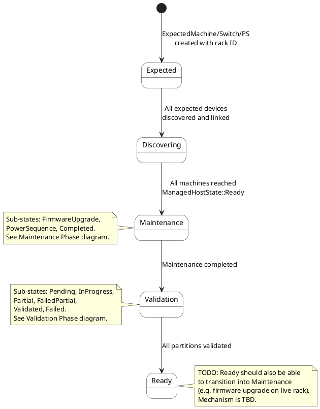
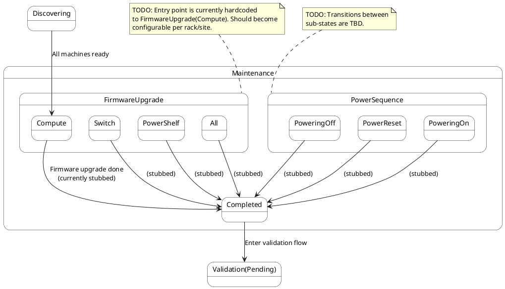
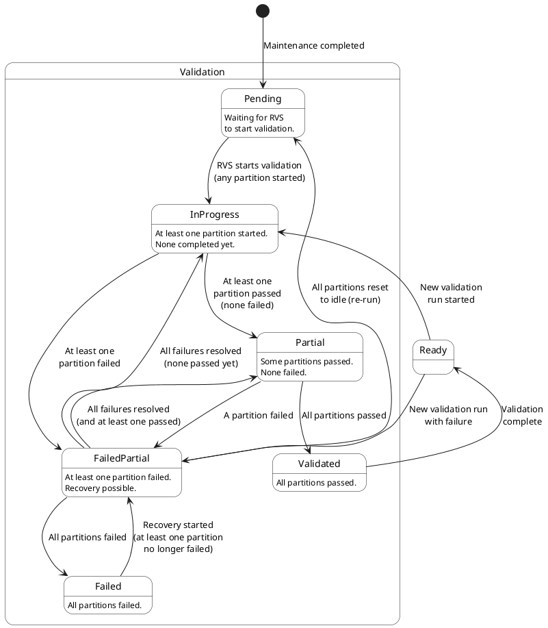

# Rack State Machine

This document describes the Finite State Machine (FSM) that governs the lifecycle of a rack in NCX -- from initial discovery through maintenance, partition-aware validation, and production readiness.

## Design Principles

The rack state machine follows a few key architectural principles:

- **NCX is minimal**: It only tracks rack/partition state -- it does not orchestrate tests or define which firmware to apply.
- **RVS (Rack Validation Service) drives validation**: An external validation service sets machine metadata labels after an instance creation that NCX polls to derive validation progress.
- **Partition-aware**: Validation is tracked at the partition level (groups of nodes, e.g. NVLink domains), not individual components.
- **Maintenance is pluggable**: Firmware upgrades and power sequencing are handled as sub-states with stub transitions, ready for integration with Rack Manager Service.

## High-Level Overview

The following shows the primary states and transitions between them. Note that Error and Deleting states are omitted and transitions out of them are TBD:

<!-- Keep the empty line after this or here or the diagram will break -->

## State Descriptions

| State | Description |
|-------|-------------|
| **Expected** | Initial state. Rack is expected -- waiting for machines, switches, and power shelves to be discovered. Created when `ExpectedMachine`/`ExpectedSwitch`/`ExpectedPowerShelf` references this rack ID. |
| **Discovering** | At least some devices have been linked. Waiting for all expected devices to appear and for all compute trays to reach `ManagedHostState::Ready`. |
| **Maintenance** | Rack is undergoing maintenance (firmware upgrades, power sequencing). See [Maintenance Phase](#maintenance-phase) for sub-states. |
| **Validation** | Rack is in the validation phase. RVS drives partition-level validation via machine metadata labels. See [Validation Phase](#validation-phase) for sub-states. |
| **Ready** | Rack is fully validated and available for production workloads. Monitors for new validation runs. |
| **Error** | Unrecoverable error. Requires manual intervention. Mechanism TBD. **Not shown on the diagram** |
| **Deleting** | Rack is being deleted. Terminal state. Transitioning out of it is TBD. **Not shown on the diagram** |

## Maintenance Phase

After all machines are discovered and ready, the rack enters maintenance before validation begins. Maintenance is currently stubbed -- the firmware upgrade sub-state immediately completes.

<!-- Keep the empty line after this or here or the diagram will break -->

### Maintenance Sub-States

| Sub-State | Description |
|-----------|-------------|
| **FirmwareUpgrade(Compute)** | Firmware upgrade for compute trays. Currently the hardcoded entry point from `Discovering`. |
| **FirmwareUpgrade(Switch)** | Firmware upgrade for switches. Stubbed. |
| **FirmwareUpgrade(PowerShelf)** | Firmware upgrade for power shelves. Stubbed. |
| **FirmwareUpgrade(All)** | Full-rack firmware upgrade, likely delegated to Rack Manager. Stubbed. |
| **PowerSequence(PoweringOn)** | Power-on sequencing. Stubbed. |
| **PowerSequence(PoweringOff)** | Power-off sequencing. Stubbed. |
| **PowerSequence(PowerReset)** | Power reset sequencing. Stubbed. |
| **Completed** | Maintenance is done. Transitions to `Validation(Pending)` to enter the validation flow. |

## Validation Phase

Validation is **partition-aware** and **externally driven**. NCX does not orchestrate tests -- it polls machine metadata labels set by RVS and aggregates partition status to compute state transitions.

All validation states are sub-states of `Validation { rack_validation }`, mirroring the pattern used by `Maintenance { rack_maintenance }`.

<!-- Keep the empty line after this or here or the diagram will break -->

### Validation Sub-States

| Sub-State | Description |
|-----------|-------------|
| **Pending** | All nodes discovered, all machines ready, maintenance complete. Waiting for RVS to begin partition validation. Entry point into the validation phase. |
| **InProgress** | At least one partition has started validation, but none have completed yet. |
| **Partial** | At least one partition has passed validation. No partitions have failed. Waiting for remaining partitions to complete. |
| **FailedPartial** | At least one partition has failed validation. Can recover if failed partitions are re-validated successfully. Can also transition back to Pending if all partitions are reset to idle (e.g. RVS clears labels before a re-run). |
| **Validated** | All partitions have passed validation. The handler promotes this to the top-level `Ready` state. |
| **Failed** | All partitions have failed validation. Requires intervention or re-validation. Can recover if at least one partition is retried (transitions to FailedPartial). |

### How Validation State is Derived

NCX derives validation state by reading metadata labels on the rack's machines directly. The labels are set by RVS. Machine metadata persists across instance create/delete cycles, so validation state survives ephemeral instance lifetimes.

#### Machine Metadata Labels

| Label | Values | Purpose |
|-------|--------|---------|
| `rv.part-id` | String (e.g. `"nvlink-domain-0"`) | Groups nodes into validation partitions |
| `rv.st` | `idle`, `inp`, `pass`, `fail` | Per-node validation status |
| `rv.run-id` | String (e.g. `"run-20250227-001"`) | Correlates nodes in the same validation run |
| `rv.fail-desc` | String (e.g. `"nccl-allreduce-timeout"`) | Failure description (only when `rv.st = fail`) |

Machines without the `rv.part-id` label are **not** validation participants and are silently skipped.

#### Per-Partition Aggregation

For each partition (group of nodes sharing the same `rv.part-id`), the aggregate status is determined from the individual node statuses:

| Condition | Partition Status |
|-----------|-----------------|
| Any node has `rv.st = fail` | **Failed** |
| Else if any node has `rv.st = inp` | **InProgress** |
| Else if all nodes have `rv.st = pass` | **Validated** |
| Otherwise | **Pending** |

The per-partition statuses are then counted to produce a `RackPartitionSummary`, which drives the state transitions shown in the diagram above.

## Key Implementation Files

| File | Purpose |
|------|---------|
| `crates/api-model/src/rack.rs` | `RackState` enum, `RackValidationState` sub-enum, `RackMaintenanceState` sub-enum, serde config |
| `crates/api/src/state_controller/rack/handler.rs` | State handler, `compute_validation_transition()`, `RvPartitions`, `MachineRvState`, `load_partition_summary()` |
| `crates/api/src/state_controller/rack/io.rs` | DB persistence, metrics, state history |
| `crates/api/src/state_controller/rack/context.rs` | Handler context (services, DB pool) |

## Open Items

- **Node-level gating**:  Node-level NCX SMs are unaware about potential Rack Validation that could happen. Since our design requires waiting until all machines are ingested before kicking off validation, there is a race condition: RVS needs machines to be READY, but other consumers may also wait for READY and try to create instances on those nodes at the same time. Instead of introducing a new ManagedHostState variant, we use the existing health override mechanism.
- **Maintenance from Ready**: A mechanism for triggering firmware upgrades on an already-running rack (transition from `Ready` back into `Maintenance`).
- **Configurable maintenance entry point**: The entry into maintenance is hardcoded to `FirmwareUpgrade(Compute)`. Should be configurable per rack/site.
- **SLA definitions**: No SLA timeouts are defined for any rack state yet.
- **Maintenance sub-state transitions**: The firmware upgrade and power sequencing sub-states are stubbed. Full orchestration via Rack Manager Service is TBD.
